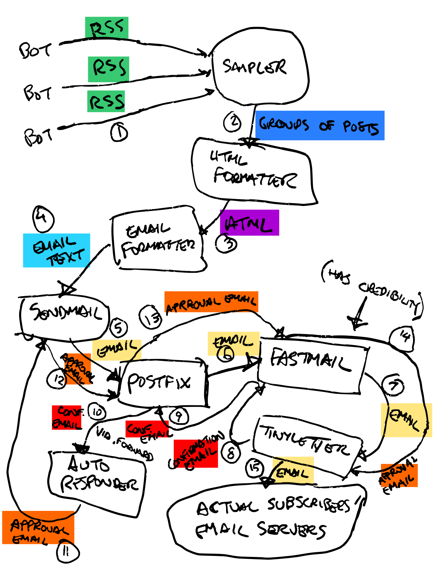

email-rss-sample
==================

Grabs several RSS feeds and picks samples from each one from the given time period, then generates an email summary and sends it via sendmail.

Why
---

I use it to automate creation and sending of a [daily email](https://tinyletter.com/bots) containing recent posts from my [bots](https://smidgeo.com/bots), which are computer processes that generate art in small bits a few times each day.

You can use it to sample and send any RSS content, not just bot-generated content, in an HTML-formatted email.

This is a diagram of my bot email system. ([Full account of how to set it up here.](https://jimkang.com/weblog/articles/running-your-own-email-server/)) The code in this repo does parts 1-4, as well as part 11, if you happen to need something to respond to confirmation request emails automatically.

Installation
------------

- Clone this repo.
- Create a `config.mk` in the project root directory. Fill out the following fields in it:

        USER = <The Unix user you want to use to deploy to your server. You can skip this if you're not going to deploy.>
        SERVER = <The server you want to deploy this to. Skip if you're not going to deploy it anywhere else.
        TO_EMAIL = <The email address that you want the generated emails to go to.>
        FROM_EMAIL = <The email address that goes in the From: field.>

- Set up an MTA if you haven't already.

This program relies on `sendmail` to actually send the mail. Usually, for `sendmail` to work, you need to have set up a mail transfer agent (MTA) on the machine that accepts mail from sendmail and relays it to other mail servers. I used the postfix MTA because it comes pre-installed on Ubuntu. [Here's my notes on setting it up.](https://github.com/jimkang/knowledge/blob/master/email.md#setting-up-the-mta) It took me hours; hopefully, you have better luck! 

- Edit the `build-html` target in the `Makefile` (TODO: Make these variables in config.mk) so that it lists the RSS feeds you want to sample instead of these:

        build-html:
           node sample-rss-into-html.js \
             --styleMarkupFile behavior/bots-style.html \
             https://smidgeo.com/bots/godtributes/rss/index.rss \
             https://smidgeo.com/bots/colorer/rss/index.rss \
             https://smidgeo.com/bots/autocompletejok/rss/index.rss \
             https://smidgeo.com/bots/hills/rss/index.rss \
             https://smidgeo.com/bots/dem-bones/rss/index.rss \
             https://smidgeo.com/bots/fuckingshakespeare/rss/index.rss \
              > launch-bay/email.html

- Point the `--styleMarkupFile` param to a file containing the CSS you want to be used to style the email contents. You can start with `behavior/default-style.html` and edit it or make copy of it, edit that, then point `--styleMarkupFile` at that. (You can iteratively check out your changes to the style file by running `make build-html` and then looking at `launch-bay/email.html`.

- If you need an autoresponder (in my case, when this program sent an email to a mailing list, the mailing list replied with an email asking to confirm that it really wanted to send the email to the mailing list), edit the user's `.forward` file to forward mail to the responder program:

        \<username that the program runs as>, "|<location of this project on your server>/respond-to-confirmation.js"

Then, edit the to: and from: values that `respond-to-confirmation.js` checks for. (It avoids responding to things not addressed to it and from a particular address.)

Usage
-----

To run the whole sampling, email building, and sending chain, run `make build-and-send-mail`. If you want to run this automatically and periodically, through an entry like this into your cron:

    # Daily email at 7 AM
    0 7 * * * cd <location of this project on your server> && make build-and-send-email

You can also just run parts of the process.

- `make build-html` to sample the RSS and make an HTML file from the posts.
- `make build-email` to do `build-html` then also generate email text, including headers.
- `make send-email` to send `launch-bay/email.txt` through `sendmail`.

Tests
-----

Run tests with `make test`. Some of the tests you require visually inspecting generated HTML files. The test output will tell you what files to look at.

License
-------

The MIT License (MIT)

Copyright (c) 2019 Jim Kang

Permission is hereby granted, free of charge, to any person obtaining a copy
of this software and associated documentation files (the 'Software'), to deal
in the Software without restriction, including without limitation the rights
to use, copy, modify, merge, publish, distribute, sublicense, and/or sell
copies of the Software, and to permit persons to whom the Software is
furnished to do so, subject to the following conditions:

The above copyright notice and this permission notice shall be included in
all copies or substantial portions of the Software.

THE SOFTWARE IS PROVIDED 'AS IS', WITHOUT WARRANTY OF ANY KIND, EXPRESS OR
IMPLIED, INCLUDING BUT NOT LIMITED TO THE WARRANTIES OF MERCHANTABILITY,
FITNESS FOR A PARTICULAR PURPOSE AND NONINFRINGEMENT. IN NO EVENT SHALL THE
AUTHORS OR COPYRIGHT HOLDERS BE LIABLE FOR ANY CLAIM, DAMAGES OR OTHER
LIABILITY, WHETHER IN AN ACTION OF CONTRACT, TORT OR OTHERWISE, ARISING FROM,
OUT OF OR IN CONNECTION WITH THE SOFTWARE OR THE USE OR OTHER DEALINGS IN
THE SOFTWARE.
